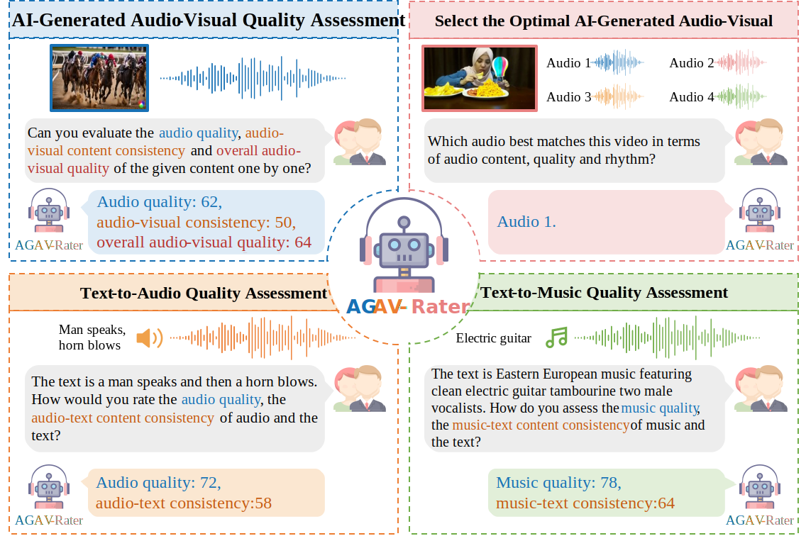

<div align="center">

# AGAV-Rater: Adapting Large Multimodal Model for AI-Generated Audio-Visual Quality Assessment


🎉 **<span style="color:#8B0000">Accepted by ICML 2025</span>**


[](https://arxiv.org/pdf/2501.18314v1)
[](https://agav-rater.github.io/)
<!-- [](https://) -->
[](https://huggingface.co/caoyuqin/AGAV-Rater)
[](https://huggingface.co/datasets/caoyuqin/AGAVQA-3k)
</div>



Official implementation of **AGAV-Rater: Adapting Large Multimodal Model for AI-Generated Audio-Visual Quality Assessment**, ICML 2025

Yuqin Cao<sup>1</sup>, Xiongkuo Min<sup>1</sup><sup>#</sup>, Yixuan Gao<sup>1</sup>, Wei Sun<sup>2</sup>, Guangtao Zhai<sup>1</sup><sup>#</sup>

<sup>1</sup>Shanghai Jiao Tong University, <sup>2</sup>East China Normal University, <sup>#</sup>Corresponding author(s). 

## Installation
```shell
git clone https://github.com/charlotte9524/AGAV-Rater.git
cd AGAV-Rater

# create conda environment
conda create -n agav-rater python=3.9
conda activate agav-rater

# install requirements
pip install -r requirements.txt
apt-get update && apt-get install ffmpeg libsm6 libxext6  -y
conda install mpi4py
pip install pytorchvideo
```

## TODO
- [ ] Release the training script
- ✅ Release the checkpoint on AGAVQA-MOS subset
- ✅ Release the AGAVQA-3k dataset
- ✅ Release the inference script


## Get Datasets
You can download AGAVQA-MOS and AGAVQA-Pair as follows:
```python
import os, glob
from huggingface_hub import snapshot_download


snapshot_download("caoyuqin/AGAVQA-3k", repo_type="dataset", local_dir="./dataset", local_dir_use_symlinks=False)

gz_files = glob.glob("dataset/*.zip")

for gz_file in gz_files:
    print(gz_file)
    os.system("unzip {} -d ./dataset/".format(gz_file))
```

## Get Checkpoints
You can download our checkpoints on the AGAVQA-MOS subset as follows:
```python
from huggingface_hub import snapshot_download

snapshot_download("caoyuqin/AGAV-Rater", repo_type="model", local_dir="./checkpoints", local_dir_use_symlinks=False)
```

## Inference
```python
    python inference.py --model-path=./checkpoints --video-path=<path>
```

## Example
```python
    python inference.py --model-path=./checkpoints --video-path=./assets/33_sora_elevenlabs_2_rank1.mp4
    #Audio quality: 50.5938, audio-visual consistency: 63.5000, overall audio-visual quality: 52.8438
```
```python
    python inference.py --model-path=./checkpoints --video-path=./assets/33_sora_elevenlabs_0_rank2.mp4
    #Audio quality: 41.4375, audio-visual consistency: 50.5938, overall audio-visual quality: 41.4375
```

```python
    python inference.py --model-path=./checkpoints --video-path=./assets/33_sora_elevenlabs_1_rank3.mp4
    #Audio quality: 25.7812, audio-visual consistency: 56.4375, overall audio-visual quality: 37.8438
```

```python
    python inference.py --model-path=./checkpoints --video-path=./assets/33_sora_elevenlabs_4_rank4.mp4
    #Audio quality: 21.0000, audio-visual consistency: 52.3438, overall audio-visual quality: 33.8125
```

## Contact

Please contact the first author of this paper for queries.

- Yuqin Cao, caoyuqin@sjtu.edu.cn


## Citation

```bibtex
@article{cao2025agav,
  title={AGAV-Rater: Adapting Large Multimodal Model for AI-Generated Audio-Visual Quality Assessment},
  author={Cao, Yuqin and Min, Xiongkuo and Gao, Yixuan and Sun, Wei and Zhai, Guangtao},
  journal={arXiv preprint arXiv:2501.18314},
  year={2025}
}
```